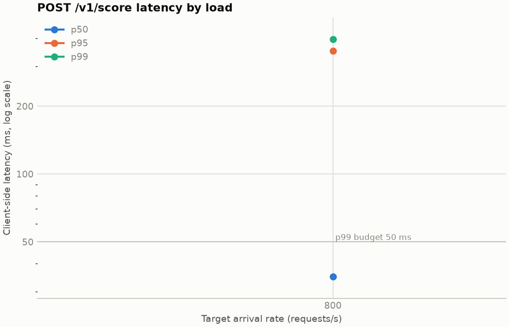
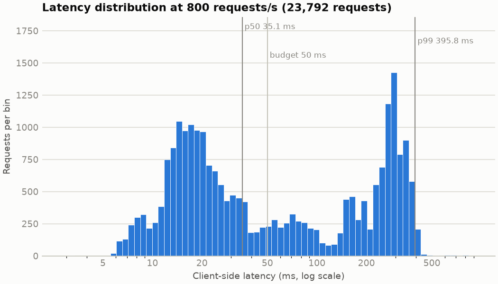

# Scoring latency: POST /v1/score

Measured by `bastion bench latency` at git revision `083d588-dirty`. Client and server ran on the same laptop, so the client competes with the service for CPU.

## Machine

| | |
|---|---|
| cpu | 12th Gen Intel(R) Core(TM) i7-1255U |
| logical_cpus | 12 |
| memory | 15.3 GiB |
| os | Linux 7.0.2-arch1-1 |
| python | 3.12.14 |
| cpu_governor | powersave |
| on_ac_power | yes |

## Setup

| | |
|---|---|
| Service | `bastion serve`, 1 worker process(es), JSONL decision log |
| Model | local/da7db7ba6d194aae8cddbe1d35519fc3 (37 inputs), synthetic training data |
| Online store | Redis 8.6.6 in a rootless Podman container, host network |
| History in Redis | 271,529 events and 248,582 labels |
| Requests | 20,000 synthetic payloads, cycled |
| Load generator | k6 (docker.io/grafana/k6:1.8.1) in a container, host network, constant arrival rate |
| Per rate | 30 s, after one 10 s warm-up run |

## Results by arrival rate

Client latency is measured by k6 from request start to response end; server stages come from the decision log of the same requests. **Sustained** means every scheduled request started, none failed, and the achieved rate stayed within 2% of the target. HTTP status 0 means k6 received no response (connection reset or timeout).

| Target rps | Achieved rps | Sustained | Dropped | Errors | HTTP status | p50 ms | p95 ms | p99 ms | max ms | server p99 ms |
|---|---|---|---|---|---|---|---|---|---|---|
| 800 | 787.2 | no | 208 | 2.33% | 200: 23,238 · 503: 554 | 35.14 | 351.12 | 395.81 | 789.16 | 277.27 |

## Stage breakdown at 800 requests/s

Client p99 **395.81 ms** against the 50 ms budget: over budget at this rate.

| Stage | Budget (p99) | p50 ms | p95 ms | p99 ms | max ms |
|---|---|---|---|---|---|
| Redis round trip + event-loop wait | 12 ms | 21.64 | 236.19 | 276.72 | 715.26 |
| Feature evaluation + row | 4 ms | 0.42 | 0.56 | 0.95 | 2.38 |
| LightGBM + calibration | 8 ms | 0.11 | 0.23 | 0.32 | 1.47 |
| Handler total | n/a | 22.26 | 236.74 | 277.27 | 715.75 |

The Redis stage runs from the start of the handler until the pipeline's replies have been processed. With one event-loop thread per worker, it therefore also includes time a request waits while other requests run feature evaluation, which is why its tail grows with load.

The handler total excludes HTTP parsing, validation and response serialisation; the gap between it and the client-side latency is the rest of the request path, plus the client's own overhead on a shared machine.
