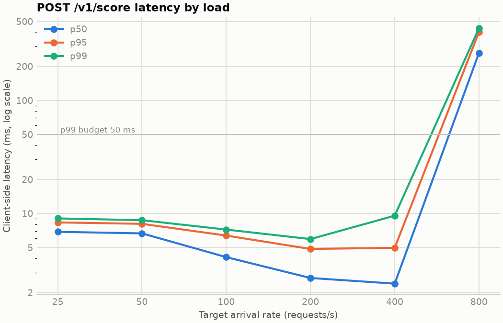
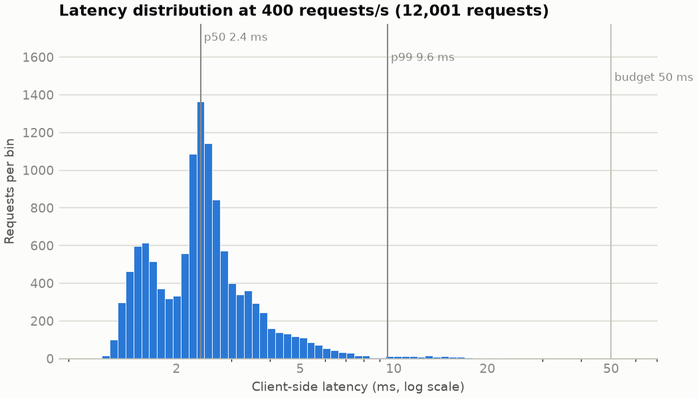

# Scoring latency: POST /v1/score

Measured by `bastion bench latency` at git revision `ec55475-dirty`. Client and server ran on the same laptop, so the client competes with the service for CPU.

## Machine

| | |
|---|---|
| cpu | 12th Gen Intel(R) Core(TM) i7-1255U |
| logical_cpus | 12 |
| memory | 15.3 GiB |
| os | Linux 7.0.2-arch1-1 |
| python | 3.12.14 |
| cpu_governor | powersave |
| on_ac_power | yes |

## Setup

| | |
|---|---|
| Service | `bastion serve`, 1 worker process(es), JSONL decision log |
| Model | local/da7db7ba6d194aae8cddbe1d35519fc3 (37 inputs), synthetic training data |
| Online store | Redis 8.6.6 in a rootless Podman container, host network |
| History in Redis | 271,529 events and 248,582 labels |
| Requests | 20,000 synthetic payloads, cycled |
| Load generator | k6 (docker.io/grafana/k6:1.8.1) in a container, host network, constant arrival rate |
| Per rate | 30 s, after one 10 s warm-up run |
| Policy | 200 reviews/day, review threshold 0.00 (tuned), top 3 reason codes |

## Results by arrival rate

Client latency is measured by k6 from request start to response end; server stages come from the decision log of the same requests. **Sustained** means every scheduled request started, none failed, and the achieved rate stayed within 2% of the target. HTTP status 0 means k6 received no response (connection reset or timeout).

| Target rps | Achieved rps | Sustained | Dropped | Errors | HTTP status | p50 ms | p95 ms | p99 ms | max ms | server p99 ms |
|---|---|---|---|---|---|---|---|---|---|---|
| 25 | 25.0 | yes | 0 | 0.00% | 200: 751 | 6.88 | 8.32 | 9.03 | 10.29 | 6.49 |
| 50 | 50.0 | yes | 0 | 0.00% | 200: 1,501 | 6.66 | 8.09 | 8.71 | 59.21 | 6.39 |
| 100 | 100.0 | yes | 0 | 0.00% | 200: 3,001 | 4.10 | 6.37 | 7.20 | 11.14 | 5.49 |
| 200 | 200.0 | yes | 0 | 0.00% | 200: 6,000 | 2.68 | 4.85 | 5.93 | 13.67 | 4.30 |
| 400 | 400.0 | yes | 0 | 0.00% | 200: 12,001 | 2.39 | 4.96 | 9.55 | 21.64 | 5.92 |
| 800 | 785.0 | no | 232 | 10.04% | 200: 21,382 · 503: 2,386 | 262.85 | 402.72 | 434.98 | 531.32 | 310.24 |

## Stage breakdown at 400 requests/s

Client p99 **9.55 ms** against the 50 ms budget: within budget at this rate.

| Stage | Budget (p99) | p50 ms | p95 ms | p99 ms | max ms |
|---|---|---|---|---|---|
| Redis round trip + event-loop wait | 12 ms | 0.62 | 2.10 | 4.42 | 17.22 |
| Feature evaluation + row | 4 ms | 0.83 | 1.17 | 1.47 | 2.90 |
| LightGBM + calibration | 8 ms | 0.17 | 0.27 | 0.34 | 1.43 |
| Policy: overrides, expected cost, review capacity | 3 ms | 0.06 | 0.08 | 0.11 | 0.37 |
| Reason codes (reviewed and blocked only) | n/a | 2.05 | 4.22 | 4.54 | 4.57 |
| Handler total | n/a | 1.73 | 3.27 | 5.92 | 17.82 |

Decisions logged at this rate: approve 11,886, block 113, review 2.

The Redis stage runs from the start of the handler until the pipeline's replies have been processed. With one event-loop thread per worker, it therefore also includes time a request waits while other requests run feature evaluation, which is why its tail grows with load.

The handler total excludes HTTP parsing, validation and response serialisation; the gap between it and the client-side latency is the rest of the request path, plus the client's own overhead on a shared machine.
